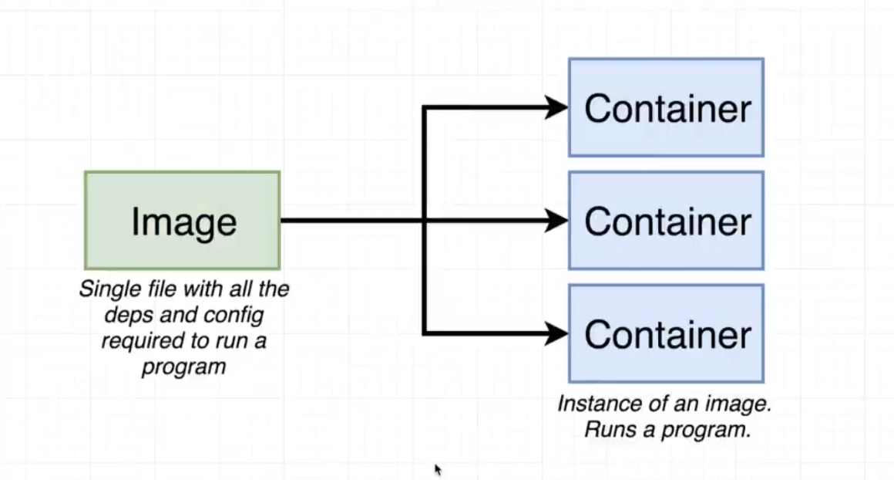

## What is Docker?
Docker allows you to package your application + all its dependencies into a single unit so it runs the same on every system (laptop, server, cloud).

## Why Docker is used?
- No `works on my machine` problem
- Fast application deployment
- Lightweight compared to virtual machines
- Easy scaling and portability

## What is Docker images?
A Docker Image is a read-only blueprint used to create containers.

 </img>

### What does an image contain?
- Application code
- Runtime (Java, Python, Node, etc.)
- Libraries & dependencies
- OS-level files

## What is Docker Containers? 
A Docker Container is a running instance of a Docker Image.

## Simple Example: 
```Bash 
docker pull nginx        # download image
docker run nginx         # run container
```

- `docker pull` → gets the image
- `docker run` → creates & runs a container